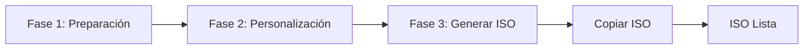
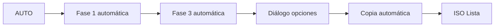

# 📘 Guía de Uso - Eggsmaker WEB

## 📋 Índice

1. [Introducción](#introducción)
2. [Instalación](#instalación)
3. [Primer Inicio](#primer-inicio)
4. [Interfaz Principal](#interfaz-principal)
5. [Flujo de Trabajo](#flujo-de-trabajo)
6. [Guía Paso a Paso](#guía-paso-a-paso)
7. [Modo AUTO](#modo-auto)
8. [Opciones Avanzadas](#opciones-avanzadas)
9. [Resolución de Problemas](#resolución-de-problemas)
10. [Preguntas Frecuentes](#preguntas-frecuentes)

---

## 🎯 Introducción

**Eggsmaker WEB** es una interfaz gráfica web moderna para **Penguins' Eggs**, la herramienta de creación de ISOs remasterizables de sistemas Linux.

### ¿Qué hace Eggsmaker WEB?

- ✅ Crea ISOs de tu sistema Linux actual
- ✅ Clona tu escritorio y configuraciones
- ✅ Personaliza la configuración de la ISO
- ✅ Copia ISOs generadas a ubicaciones personalizadas
- ✅ Gestiona y actualiza Penguins' Eggs y Calamares
- ✅ Limpia sesiones de trabajo

### Requisitos Previos

- **Penguins' Eggs** instalado en el sistema
- Permisos de **sudo** (se solicitará la contraseña al inicio)
- Python 3.8 o superior
- Conexión a internet (para actualizaciones)

---

## 📦 Instalación

### Método 1: Instalador Automático (Recomendado)

#### Instalación Local (Usuario)
```bash
cd /ruta/a/eggsmaker-nicegui
./install.sh
```

Esto instalará Eggsmaker WEB en `~/.local/share/eggsmaker-web`

#### Instalación Global (Sistema)
```bash
cd /ruta/a/eggsmaker-nicegui
sudo ./install.sh --system
```

Esto instalará Eggsmaker WEB en `/opt/eggsmaker-web`

### Método 2: Instalación con pip

```bash
cd /ruta/a/eggsmaker-nicegui
pip install -e .
```

### Método 3: Ejecución Directa (Sin Instalación)

```bash
cd /ruta/a/eggsmaker-nicegui
python3 main.py
```

---

## 🚀 Primer Inicio

### 1. Ejecutar la Aplicación

Después de la instalación:
```bash
eggsmaker-web
```

O desde el menú de aplicaciones: buscar **"Eggsmaker WEB"**

### 2. Autenticación Inicial

Al iniciar, se mostrará un diálogo solicitando la **contraseña de sudo**:

```
┌─────────────────────────────┐
│ Autenticación requerida     │
│ (sudo)                      │
│                             │
│ Contraseña de sudo: [****] │
│                             │
│ [Aceptar]  [Cancelar]      │
└─────────────────────────────┘
```

> 💡 **Importante**: Esta contraseña se requiere para ejecutar comandos privilegiados de Penguins' Eggs.

### 3. Navegador Web

La aplicación se abrirá automáticamente en tu navegador predeterminado en:
```
http://localhost:8080
```

Si necesitas acceder desde otro dispositivo en la red:
```
http://IP_DE_TU_MAQUINA:8080
```

---

## 🖥️ Interfaz Principal

### Barra Superior

```
┌──────────────────────────────────────────────────────────────┐
│ 🥚 Eggsmaker - Versión 25.12.01      Eggsmaker              │
│                                                              │
│                              Penguins' Eggs: X.X.X           │
│                              Calamares: X.X.X                │
└──────────────────────────────────────────────────────────────┘
```

### Terminal de Salida

```
┌──────────────────────────────────────────────────────────────┐
│ Terminal de salida (log de comandos y operaciones)         │
│                                                              │
│ > Iniciando...                                              │
│ > ...                                                        │
└──────────────────────────────────────────────────────────────┘
```

### Panel de Control (6 Tarjetas)

```
┌──────────┬──────────┬──────────┬──────────┬──────────┬──────────┐
│ Fase 1   │ Fase 2   │ Fase 3   │ Copiar   │  AUTO    │ Sesión   │
│          │          │          │   ISO    │          │          │
└──────────┴──────────┴──────────┴──────────┴──────────┴──────────┘
```

### Barra de Estado

```
┌──────────────────────────────────────────────────────────────┐
│ Estado: Esperando                                            │
│ ████████████████████░░░░░░░░░ 65%                          │
│                                                              │
│ 65% | Copias: 2 | ISO: 3.5 GB | Copia: 00:02:30 | ...      │
└──────────────────────────────────────────────────────────────┘
```

---

## 🔄 Flujo de Trabajo

### Flujo Completo (3 Fases + Copia)



### Flujo Automático



---

## 📖 Guía Paso a Paso

### 🔹 FASE 1: Preparación

**Objetivo**: Preparar el sistema para la creación de la ISO

#### Opciones:

**🔘 Inicio (Manual)**
- `Activado`: Ejecuta solo limpieza y preparación básica
- `Desactivado`: Cambia a modo AUTO (ver sección Modo AUTO)

**🔘 Actualizar Eggs y Calamares**
- `Activado`: Descarga e instala las últimas versiones de Penguins' Eggs y Calamares desde GitHub
- `Desactivado`: Usa las versiones instaladas actualmente

> ⚠️ **Nota**: Si activas "Actualizar Eggs y Calamares", el interruptor "Inicio (Manual)" se desactivará automáticamente.

#### Acciones realizadas:

1. `eggs kill -n` - Detiene procesos previos de Eggs
2. `eggs tools clean -n` - Limpia archivos temporales
3. `eggs dad -d` - Verifica y crea estructura de directorios
4. `eggs calamares --install` - Instala Calamares (si está activado)

#### Botón: **[Fase 1]**

Al completar, habilita las opciones de Fase 2.

---

### 🔹 FASE 2: Personalización (Opcional)

**Objetivo**: Personalizar el contenido de la ISO

#### Opciones:

**🔘 Clonar Escritorio**
- Copia tu escritorio actual al perfil de usuario de la ISO
- Incluye: configuraciones, temas, iconos, fondos de pantalla, etc.
- Comando ejecutado: `sudo eggs tools skel`

**🔘 Personalizar ISO**
- Abre un diálogo para editar configuraciones avanzadas de la ISO
- Permite configurar:
  - **Contraseña de root**: Contraseña del usuario root en la ISO
  - **Nombre base del snapshot**: Nombre base para la ISO (ej: "mi-distro")
  - **Prefijo del snapshot**: Prefijo adicional (ej: "personalizada-")
  - **Contraseña de usuario**: Contraseña predeterminada para usuarios

> 💡 **Tip**: Estas configuraciones se guardan en `/etc/penguins-eggs.d/eggs.yaml`

#### Botón: **[Fase 2]**

Ejecuta las acciones seleccionadas. Esta fase es opcional.

---

### 🔹 FASE 3: Generar ISO

**Objetivo**: Crear el archivo ISO de tu sistema

#### Opciones:

**🔘 Incluir datos**
- `Activado`: Crea ISO con `/home` completo (modo clone)
- `Desactivado`: Crea ISO solo del sistema (más ligera)
- Comando: `sudo eggs produce --clone -n` (activado) o `sudo eggs produce --noicon -n` (desactivado)

**🔘 Máxima compresión**
- `Activado`: Crea ISO con compresión máxima (más pequeña, más lenta)
- `Desactivado`: Compresión estándar
- Comando: `sudo eggs produce --pendrive -n`

> ⚠️ **Advertencia**: La generación de ISO puede tardar varios minutos dependiendo del tamaño del sistema.

#### Botón: **[Fase 3]**

Durante la generación:
- Barra de progreso en modo "indeterminado" (ondulante)
- Estado: "Ejecutando: Fase 3 (Generar ISO)"
- Terminal muestra salida en tiempo real

Al finalizar:
- Se muestra el tamaño de la ISO generada
- Ubicación típica: `/home/eggs/*.iso` o `/home/eggs/.mnt/*.iso`

---

### 🔹 COPIAR ISO

**Objetivo**: Copiar la ISO generada a una ubicación personalizada

#### Opciones:

**🔘 Rápida**
- `Activado`: Copia a máxima velocidad
- `Desactivado`: Copia con pausa (más lenta, menos carga del sistema)

**📁 Directorio Destino**
- Campo de texto con la ruta destino
- Click en 🗁 para abrir navegador de directorios
- Por defecto: directorio home del usuario

#### Selector de Directorio

```
┌─────────────────────────────────────┐
│ Seleccionar directorio destino     │
├─────────────────────────────────────┤
│ Ruta actual: /home/usuario          │
│                                     │
│ 📁 Documentos                       │
│ 📁 Descargas                        │
│ 📁 Escritorio                       │
│ 📁 Imágenes                         │
│ 📁 usb-drive                        │
│                                     │
│         [Cancelar] [Seleccionar]    │
└─────────────────────────────────────┘
```

#### Botón: **[Copiar ISO]**

Durante la copia:
- Barra de progreso **roja** con porcentaje
- Estado: "Ejecutando: Copiar ISO"
- Muestra: `XX%` en grande
- Contador de copias realizadas se incrementa

> 💡 **Tip**: Puedes copiar la misma ISO múltiples veces a diferentes ubicaciones.

---

### 🔹 MODO AUTO

**Objetivo**: Ejecutar todo el proceso automáticamente

#### ¿Cómo activar el modo AUTO?

Desactiva el interruptor **"Inicio (Manual)"** en Fase 1:
- El botón de Fase 1 cambiará a "fresh-eggs/calamares"
- El botón AUTO se habilitará

#### Flujo del Modo AUTO:

1. **Fase 1**: Ejecuta preparación automáticamente
2. **Fase 3**: Genera la ISO automáticamente
3. **Diálogo de opciones de copia**: Se muestra automáticamente

```
┌─────────────────────────────────────┐
│ Opciones de Copia                   │
├─────────────────────────────────────┤
│ 🔘 Copia Rápida                     │
│                                     │
│ Directorio Destino:                 │
│ /home/usuario [🗁]                  │
│                                     │
│         [Cancelar] [Continuar]      │
└─────────────────────────────────────┘
```

4. **Copia**: Copia la ISO según las opciones seleccionadas

#### Botón: **[AUTO]**

Inicia todo el proceso con un solo click.

**Indicadores Visuales:**
- 🔴 **Rojo (Pulsando)**: El proceso AUTO está en ejecución.
- 🟢 **Verde**: El proceso ha finalizado exitosamente.
- 🔵 **Azul**: Estado normal / inactivo.

> ⚠️ **Nota**: La Fase 2 (personalización) NO se ejecuta en modo AUTO. Si necesitas personalizar, usa el flujo manual.

---

### 🔹 SESIÓN: Limpiar Sesión

**Objetivo**: Eliminar la carpeta de trabajo `/home/eggs`

#### Botón: **[Limpiar sesión]**

Al hacer click, se muestra confirmación:

```
┌─────────────────────────────────────┐
│ ¿Eliminar la carpeta /home/eggs     │
│ por completo?                       │
│                                     │
│ Tamaño actual: 3.5 GB              │
│                                     │
│      [Confirmar] [Cancelar]        │
└─────────────────────────────────────┘
```

Al confirmar:
- Elimina `/home/eggs` completamente
- Limpia el terminal de log
- Libera espacio en disco

> 💡 **Cuándo usar**: Después de copiar la ISO a su ubicación final, o cuando necesites liberar espacio.

---

## ⚡ Opciones Avanzadas

### 🔧 Editar Configuración ISO

Accesible desde Fase 2 → "Personalizar ISO"

#### Campos Editables:

| Campo | Descripción | Ejemplo |
|-------|-------------|---------|
| **Contraseña de root** | Contraseña del superusuario en la ISO | `toor123` |
| **Nombre base del snapshot** | Nombre de la distribución | `mi-debian` |
| **Prefijo del snapshot** | Prefijo para versiones | `custom-` |
| **Contraseña de usuario** | Contraseña del usuario live | `live123` |

> 📝 **Archivo editado**: `/etc/penguins-eggs.d/eggs.yaml`

### 📊 Indicadores en Tiempo Real

#### Cronómetros

| Cronómetro | Color | Descripción |
|------------|-------|-------------|
| **Copia** | Cyan | Tiempo de copia actual |
| **Generación** | Rojo | Tiempo de generación ISO |
| **Total** | Verde Lima | Suma de todos los tiempos |

#### Barra de Progreso

- **Azul claro**: Operaciones normales (Fase 1, Fase 3)
- **Ondulante**: Generación de ISO (duración indeterminada)
- **Roja**: Copia de ISO (muestra porcentaje exacto)

#### Indicadores Adicionales

- **Tamaño ISO**: Se actualiza después de generar
- **Copias realizadas**: Contador de copias exitosas
- **Porcentaje**: Durante la copia (0-100%)

---

## 🔍 Resolución de Problemas

### ❌ Error: "Se requiere contraseña de sudo"

**Causa**: No se proporcionó la contraseña al inicio o expiró la sesión.

**Solución**: Recarga la página web y proporciona la contraseña nuevamente.

---

### ❌ Error: "No se encontró ISO para copiar"

**Causa**: La ISO no se generó correctamente o no está en la ubicación esperada.

**Soluciones**:
1. Verifica que la Fase 3 completó exitosamente
2. Revisa el terminal de log para errores durante la generación
3. Verifica manualmente si existe el archivo:
   ```bash
   ls -lh /home/eggs/*.iso
   ls -lh /home/eggs/.mnt/*.iso
   ```

---

### ❌ Error durante actualización de Eggs/Calamares

**Causa**: Problemas de red o permisos.

**Soluciones**:
1. Verifica tu conexión a internet
2. Intenta manualmente:
   ```bash
   cd ~
   git clone https://github.com/pieroproietti/fresh-eggs
   cd fresh-eggs
   sudo ./fresh-eggs.sh
   ```

---

### ⚠️ La aplicación no abre en el navegador

**Soluciones**:
1. Abre manualmente: `http://localhost:8080`
2. Verifica que el puerto esté disponible:
   ```bash
   netstat -tuln | grep 8080
   ```
3. Usa un puerto diferente:
   ```bash
   PORT=8081 eggsmaker-web
   ```

---

### ⚠️ "Permiso denegado" al copiar ISO

**Causa**: La ISO está en un directorio protegido.

**Solución**: La aplicación automáticamente intentará usar `sudo` para copiar.

---

### 🐛 El terminal no muestra salida

**Solución**: Recarga la página web (F5).

---

## ❓ Preguntas Frecuentes

### ¿Cuánto espacio necesito para crear una ISO?

Depende del modo:
- **Sin incluir datos**: ~2-5 GB
- **Con datos (/home completo)**: Tamaño de tu `/home` + 2-5 GB
- **Máxima compresión**: ~70-80% del tamaño normal

> 💡 **Consejo**: Usa "Limpiar sesión" después de copiar la ISO para liberar espacio.

---

### ¿Puedo usar Eggsmaker WEB desde otro dispositivo en la red?

Sí. La aplicación muestra la dirección de red en el pie de página:
```
Acceso en red: http://192.168.1.100:8080
```

Usa esa dirección desde cualquier navegador en la misma red local.

> ⚠️ **Seguridad**: Asegúrate de estar en una red confiable.

---

### ¿Qué sucede si cierro el navegador durante una operación?

La operación **continúa ejecutándose** en segundo plano. Puedes:
1. Volver a abrir `http://localhost:8080`
2. Ver el progreso en el terminal

---

### ¿Puedo cancelar una operación en progreso?

Actualmente no hay botón de cancelación. Opciones:
1. Esperar a que termine
2. Cerrar la aplicación completamente (Ctrl+C en la terminal)
3. Usar "Limpiar sesión" después para limpiar archivos parciales

---

### ¿Es seguro usar modo AUTO?

Sí, pero ten en cuenta:
- ✅ No ejecuta la Fase 2 (no clona escritorio ni personaliza)
- ✅ Usa configuraciones predeterminadas
- ❌ No permite personalización durante el proceso

**Recomendado para**: Creación rápida de ISOs estándar sin personalización.

---

### ¿Dónde se guardan las ISOs generadas?

Ubicaciones típicas (verificadas en orden):
1. `/home/eggs/` - Ubicación principal
2. `/home/eggs/.mnt/` - Ubicación alternativa

El tamaño se muestra automáticamente en la barra de estado.

---

### ¿Puedo crear múltiples ISOs sin limpiar sesión?

Sí, pero:
- ⚠️ La nueva ISO sobrescribirá la anterior en `/home/eggs/`
- 💡 **Consejo**: Copia cada ISO antes de generar la siguiente

---

### ¿Cómo actualizo Eggsmaker WEB?

```bash
cd /ruta/a/eggsmaker-nicegui
git pull
./install.sh  # Reinstalar
```

O si usaste pip:
```bash
pip install -e . --upgrade
```

---

## 📚 Recursos Adicionales

### Enlaces Útiles

- **Penguins' Eggs**: https://penguins-eggs.net/
- **Repositorio GitHub**: https://github.com/pieroproietti/penguins-eggs
- **Documentación Eggs**: https://penguins-eggs.net/docs/

### Soporte

Para problemas específicos de Eggsmaker WEB, consulta:
- El terminal de log en la aplicación
- Los archivos de log del sistema
- La comunidad de Penguins' Eggs

---

## 📝 Resumen de Comandos Rápidos

### Flujo Manual Completo
```
1. Fase 1 (Preparación)
2. Fase 2 (Personalizar - opcional)
3. Fase 3 (Generar ISO)
4. Copiar ISO
5. Limpiar sesión
```

### Flujo AUTO
```
1. Desactivar "Inicio (Manual)"
2. Click en "AUTO"
3. Esperar generación
4. Configurar opciones de copia
5. Click en "Continuar"
6. Limpiar sesión
```

### Actualización Rápida de Eggs
```
1. Activar "Actualizar Eggs y Calamares"
2. Click en "Fase 1"
3. Esperar actualización
```

---

## 🎉 ¡Disfruta creando tus ISOs!

Esta guía cubre todas las funcionalidades principales de Eggsmaker WEB. Para usos avanzados, consulta la documentación de Penguins' Eggs.

**Versión de la guía**: 1.0
**Compatible con**: Eggsmaker WEB v25.12.01
