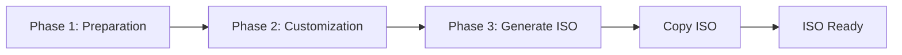
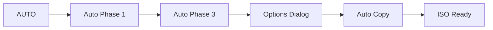

# 📘 User Guide - Eggsmaker WEB

## 📋 Index

1. [Introduction](#introduction)
2. [Installation](#installation)
3. [First Start](#first-start)
4. [Main Interface](#main-interface)
5. [Workflow](#workflow)
6. [Step-by-Step Guide](#step-by-step-guide)
7. [AUTO Mode](#auto-mode)
8. [Advanced Options](#advanced-options)
9. [Troubleshooting](#troubleshooting)
10. [FAQ](#faq)

---

## 🎯 Introduction

**Eggsmaker WEB** is a modern web graphical interface for **Penguins' Eggs**, the tool for creating remasterable ISOs of Linux systems.

### What does Eggsmaker WEB do?

- ✅ Creates ISOs of your current Linux system
- ✅ Clones your desktop and configurations
- ✅ Customizes ISO configuration
- ✅ Copies generated ISOs to custom locations
- ✅ Manages and updates Penguins' Eggs and Calamares
- ✅ Cleans up work sessions

### Prerequisites

- **Penguins' Eggs** installed on the system
- **sudo** permissions (password requested at startup)
- Python 3.8 or higher
- Internet connection (for updates)

---

## 📦 Installation

### Method 1: Automatic Installer (Recommended)

#### Local Installation (User)
```bash
cd /path/to/eggsmaker-nicegui
./install.sh
```

This will install Eggsmaker WEB in `~/.local/share/eggsmaker-web`

#### Global Installation (System)
```bash
cd /path/to/eggsmaker-nicegui
sudo ./install.sh --system
```

This will install Eggsmaker WEB in `/opt/eggsmaker-web`

### Method 2: Installation with pip

```bash
cd /path/to/eggsmaker-nicegui
pip install -e .
```

### Method 3: Direct Execution (No Installation)

```bash
cd /path/to/eggsmaker-nicegui
python3 main.py
```

---

## 🚀 First Start

### 1. Run the Application

After installation:
```bash
eggsmaker-web
```

Or from the application menu: search for **"Eggsmaker WEB"**

### 2. Initial Authentication

Upon startup, a dialog will appear requesting the **sudo password**:

```
┌─────────────────────────────┐
│ Authentication required     │
│ (sudo)                      │
│                             │
│ Sudo password: [****]       │
│                             │
│ [OK]       [Cancel]         │
└─────────────────────────────┘
```

> 💡 **Important**: This password is required to execute privileged Penguins' Eggs commands.

### 3. Web Browser

The application will automatically open in your default browser at:
```
http://localhost:8080
```

If you need to access it from another device on the network:
```
http://YOUR_MACHINE_IP:8080
```

---

## 🖥️ Main Interface

### Top Bar

```
┌──────────────────────────────────────────────────────────────┐
│ 🥚 Eggsmaker - Version 25.12.01      Eggsmaker              │
│                                                              │
│                              Penguins' Eggs: X.X.X           │
│                              Calamares: X.X.X                │
└──────────────────────────────────────────────────────────────┘
```

### Output Terminal

```
┌──────────────────────────────────────────────────────────────┐
│ Output terminal (command log and operations)               │
│                                                              │
│ > Starting...                                               │
│ > ...                                                        │
└──────────────────────────────────────────────────────────────┘
```

### Control Panel (6 Cards)

```
┌──────────┬──────────┬──────────┬──────────┬──────────┬──────────┐
│ Phase 1  │ Phase 2  │ Phase 3  │ Copy     │  AUTO    │ Session  │
│          │          │          │   ISO    │          │          │
└──────────┴──────────┴──────────┴──────────┴──────────┴──────────┘
```

### Status Bar

```
┌──────────────────────────────────────────────────────────────┐
│ Status: Waiting                                              │
│ ████████████████████░░░░░░░░░ 65%                          │
│                                                              │
│ 65% | Copies: 2 | ISO: 3.5 GB | Copy: 00:02:30 | ...       │
└──────────────────────────────────────────────────────────────┘
```

---

## 🔄 Workflow

### Full Flow (3 Phases + Copy)



### Automatic Flow



---

## 📖 Step-by-Step Guide

### 🔹 PHASE 1: Preparation

**Goal**: Prepare the system for ISO creation

#### Options:

**🔘 Start (Manual)**
- `On`: Runs only basic cleanup and preparation
- `Off`: Switches to AUTO mode (see AUTO Mode section)

**🔘 Update Eggs and Calamares**
- `On`: Downloads and installs the latest versions of Penguins' Eggs and Calamares from GitHub
- `Off`: Uses currently installed versions

> ⚠️ **Note**: If you enable "Update Eggs and Calamares", the "Start (Manual)" switch will be disabled automatically.

#### Actions performed:

1. `eggs kill -n` - Stops previous Eggs processes
2. `eggs tools clean -n` - Cleans temporary files
3. `eggs dad -d` - Checks and creates directory structure
4. `eggs calamares --install` - Installs Calamares (if enabled)

#### Button: **[Phase 1]**

Upon completion, enables Phase 2 options.

---

### 🔹 PHASE 2: Customization (Optional)

**Goal**: Customize the content of the ISO

#### Options:

**🔘 Clone Desktop**
- Copies your current desktop to the ISO user profile
- Includes: settings, themes, icons, wallpapers, etc.
- Command executed: `sudo eggs tools skel`

**🔘 Customize ISO**
- Opens a dialog to edit advanced ISO configurations
- Allows configuring:
  - **Root password**: Root user password in the ISO
  - **Snapshot basename**: Base name for the ISO (e.g., "my-distro")
  - **Snapshot prefix**: Additional prefix (e.g., "custom-")
  - **User password**: Default password for users

> 💡 **Tip**: These settings are saved in `/etc/penguins-eggs.d/eggs.yaml`

#### Button: **[Phase 2]**

Executes the selected actions. This phase is optional.

---

### 🔹 PHASE 3: Generate ISO

**Goal**: Create the ISO file of your system

#### Options:

**🔘 Include data**
- `On`: Creates ISO with full `/home` (clone mode)
- `Off`: Creates ISO of system only (lighter)
- Command: `sudo eggs produce --clone -n` (on) or `sudo eggs produce --noicon -n` (off)

**🔘 Max compression**
- `On`: Creates ISO with maximum compression (smaller, slower)
- `Off`: Standard compression
- Command: `sudo eggs produce --pendrive -n`

> ⚠️ **Warning**: ISO generation may take several minutes depending on system size.

#### Button: **[Phase 3]**

During generation:
- Progress bar in "indeterminate" mode (wavy)
- Status: "Executing: Phase 3 (Generate ISO)"
- Terminal shows real-time output

Upon completion:
- Shows the size of the generated ISO
- Typical location: `/home/eggs/*.iso` or `/home/eggs/.mnt/*.iso`

---

### 🔹 COPY ISO

**Goal**: Copy the generated ISO to a custom location

#### Options:

**🔘 Fast**
- `On`: Copies at maximum speed
- `Off`: Copies with pause (slower, less system load)

**📁 Destination Directory**
- Text field with destination path
- Click on 🗁 to open directory browser
- Default: user's home directory

#### Directory Selector

```
┌─────────────────────────────────────┐
│ Select destination directory       │
├─────────────────────────────────────┤
│ Current path: /home/user            │
│                                     │
│ 📁 Documents                        │
│ 📁 Downloads                        │
│ 📁 Desktop                          │
│ 📁 Pictures                         │
│ 📁 usb-drive                        │
│                                     │
│         [Cancel] [Select]           │
└─────────────────────────────────────┘
```

#### Button: **[Copy ISO]**

During copy:
- **Red** progress bar with percentage
- Status: "Executing: Copy ISO"
- Shows: `XX%` large
- Copies counter increments

> 💡 **Tip**: You can copy the same ISO multiple times to different locations.

---

### 🔹 AUTO MODE

**Goal**: Execute the entire process automatically

#### How to activate AUTO mode?

Disable the **"Start (Manual)"** switch in Phase 1:
- The Phase 1 button will change to "fresh-eggs/calamares"
- The AUTO button will be enabled

#### AUTO Mode Flow:

1. **Phase 1**: Executes preparation automatically
2. **Phase 3**: Generates the ISO automatically
3. **Copy Options Dialog**: Appears automatically

```
┌─────────────────────────────────────┐
│ Copy Options                        │
├─────────────────────────────────────┤
│ 🔘 Fast Copy                        │
│                                     │
│ Destination Directory:              │
│ /home/user [🗁]                     │
│                                     │
│         [Cancel] [Continue]         │
└─────────────────────────────────────┘
```

4. **Copy**: Copies the ISO according to selected options

#### Button: **[AUTO]**

Starts the entire process with a single click.

**Visual Indicators:**
- 🔴 **Red (Pulsing)**: AUTO process is running.
- 🟢 **Green**: Process has finished successfully.
- 🔵 **Blue**: Normal / inactive state.

> ⚠️ **Note**: Phase 2 (customization) is NOT executed in AUTO mode. If you need to customize, use the manual flow.

---

### 🔹 SESSION: Clean Session

**Goal**: Delete the `/home/eggs` work folder

#### Button: **[Clean session]**

On click, confirmation is shown:

```
┌─────────────────────────────────────┐
│ Delete /home/eggs folder            │
│ completely?                         │
│                                     │
│ Current size: 3.5 GB               │
│                                     │
│      [Confirm] [Cancel]            │
└─────────────────────────────────────┘
```

On confirmation:
- Deletes `/home/eggs` completely
- Clears log terminal
- Frees up disk space

> 💡 **When to use**: After copying the ISO to its final location, or when you need to free up space.

---

## ⚡ Advanced Options

### 🔧 Edit ISO Configuration

Accessible from Phase 2 → "Customize ISO"

#### Editable Fields:

| Field | Description | Example |
|-------|-------------|---------|
| **Root password** | Superuser password in the ISO | `toor123` |
| **Snapshot basename** | Distribution name | `my-debian` |
| **Snapshot prefix** | Prefix for versions | `custom-` |
| **User password** | Live user password | `live123` |

> 📝 **Edited file**: `/etc/penguins-eggs.d/eggs.yaml`

### 📊 Real-time Indicators

#### Timers

| Timer | Color | Description |
|-------|-------|-------------|
| **Copy** | Cyan | Current copy time |
| **Generation** | Red | ISO generation time |
| **Total** | Lime Green | Sum of all times |

#### Progress Bar

- **Light Blue**: Normal operations (Phase 1, Phase 3)
- **Wavy**: ISO generation (indeterminate duration)
- **Red**: ISO copy (shows exact percentage)

#### Additional Indicators

- **ISO Size**: Updates after generation
- **Copies made**: Counter of successful copies
- **Percentage**: During copy (0-100%)

---

## 🔍 Troubleshooting

### ❌ Error: "Sudo password required"

**Cause**: Password was not provided at startup or session expired.

**Solution**: Reload the web page and provide the password again.

---

### ❌ Error: "ISO to copy not found"

**Cause**: ISO was not generated correctly or is not in the expected location.

**Solutions**:
1. Verify that Phase 3 completed successfully
2. Check the log terminal for errors during generation
3. Manually verify if the file exists:
   ```bash
   ls -lh /home/eggs/*.iso
   ls -lh /home/eggs/.mnt/*.iso
   ```

---

### ❌ Error during Eggs/Calamares update

**Cause**: Network or permission issues.

**Solutions**:
1. Check your internet connection
2. Try manually:
   ```bash
   cd ~
   git clone https://github.com/pieroproietti/fresh-eggs
   cd fresh-eggs
   sudo ./fresh-eggs.sh
   ```

---

### ⚠️ Application does not open in browser

**Solutions**:
1. Manually open: `http://localhost:8080`
2. Verify port is available:
   ```bash
   netstat -tuln | grep 8080
   ```
3. Use a different port:
   ```bash
   PORT=8081 eggsmaker-web
   ```

---

### ⚠️ "Permission denied" when copying ISO

**Cause**: ISO is in a protected directory.

**Solution**: The application will automatically try to use `sudo` to copy.

---

### 🐛 Terminal shows no output

**Solution**: Reload the web page (F5).

---

## ❓ FAQ

### How much space do I need to create an ISO?

Depends on the mode:
- **Without data**: ~2-5 GB
- **With data (full /home)**: Size of your `/home` + 2-5 GB
- **Max compression**: ~70-80% of normal size

> 💡 **Tip**: Use "Clean session" after copying the ISO to free up space.

---

### Can I use Eggsmaker WEB from another device on the network?

Yes. The application shows the network address in the footer:
```
Network access: http://192.168.1.100:8080
```

Use that address from any browser on the same local network.

> ⚠️ **Security**: Ensure you are on a trusted network.

---

### What happens if I close the browser during an operation?

The operation **continues running** in the background. You can:
1. Reopen `http://localhost:8080`
2. View progress in the terminal

---

### Can I cancel an operation in progress?

Currently there is no cancel button. Options:
1. Wait for it to finish
2. Close the application completely (Ctrl+C in terminal)
3. Use "Clean session" afterwards to clean partial files

---

### Is it safe to use AUTO mode?

Yes, but keep in mind:
- ✅ Does not execute Phase 2 (does not clone desktop or customize)
- ✅ Uses default settings
- ❌ Does not allow customization during the process

**Recommended for**: Quick creation of standard ISOs without customization.

---

### Where are generated ISOs saved?

Typical locations (checked in order):
1. `/home/eggs/` - Main location
2. `/home/eggs/.mnt/` - Alternative location

Size is automatically shown in the status bar.

---

### Can I create multiple ISOs without cleaning session?

Yes, but:
- ⚠️ The new ISO will overwrite the previous one in `/home/eggs/`
- 💡 **Tip**: Copy each ISO before generating the next one

---

### How do I update Eggsmaker WEB?

```bash
cd /path/to/eggsmaker-nicegui
git pull
./install.sh  # Reinstall
```

Or if you used pip:
```bash
pip install -e . --upgrade
```

---

## 📚 Additional Resources

### Useful Links

- **Penguins' Eggs**: https://penguins-eggs.net/
- **GitHub Repository**: https://github.com/pieroproietti/penguins-eggs
- **Eggs Documentation**: https://penguins-eggs.net/docs/

### Support

For specific Eggsmaker WEB issues, check:
- The log terminal in the application
- System log files
- Penguins' Eggs community

---

## 📝 Quick Command Summary

### Full Manual Flow
```
1. Phase 1 (Preparation)
2. Phase 2 (Customize - optional)
3. Phase 3 (Generate ISO)
4. Copy ISO
5. Clean session
```

### AUTO Flow
```
1. Disable "Start (Manual)"
2. Click "AUTO"
3. Wait for generation
4. Configure copy options
5. Click "Continue"
6. Clean session
```

### Quick Eggs Update
```
1. Enable "Update Eggs and Calamares"
2. Click "Phase 1"
3. Wait for update
```

---

## 🎉 Enjoy creating your ISOs!

This guide covers all main functionalities of Eggsmaker WEB. For advanced usage, consult the Penguins' Eggs documentation.

**Guide Version**: 1.0
**Compatible with**: Eggsmaker WEB v25.12.01
