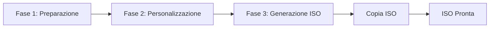
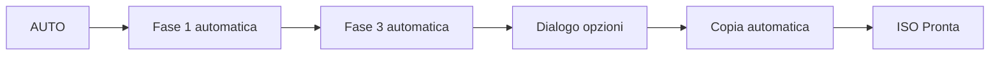

# 📘 Guida Utente - Eggsmaker WEB

## 📋 Indice

1. [Introduzione](#introduzione)
2. [Installazione](#installazione)
3. [Primo Avvio](#primo-avvio)
4. [Interfaccia Principale](#interfaccia-principale)
5. [Flusso di Lavoro](#flusso-di-lavoro)
6. [Guida Passo Passo](#guida-passo-passo)
7. [Modalità AUTO](#modalità-auto)
8. [Opzioni Avanzate](#opzioni-avanzate)
9. [Risoluzione dei Problemi](#risoluzione-dei-problemi)
10. [FAQ](#faq)

---

## 🎯 Introduzione

**Eggsmaker WEB** è una moderna interfaccia grafica web per **Penguins' Eggs**, lo strumento per creare ISO rimasterizzabili di sistemi Linux.

### Cosa fa Eggsmaker WEB?

- ✅ Crea ISO del tuo sistema Linux attuale
- ✅ Clona il tuo desktop e le configurazioni
- ✅ Personalizza la configurazione della ISO
- ✅ Copia le ISO generate in posizioni personalizzate
- ✅ Gestisce e aggiorna Penguins' Eggs e Calamares
- ✅ Pulisce le sessioni di lavoro

### Prerequisiti

- **Penguins' Eggs** installato nel sistema
- Permessi di **sudo** (verrà richiesta la password all'avvio)
- Python 3.8 o superiore
- Connessione internet (per gli aggiornamenti)

---

## 📦 Installazione

### Metodo 1: Installazione Automatica (Consigliato)

#### Installazione Locale (Utente)
```bash
cd /percorso/a/eggsmaker-nicegui
./install.sh
```

Questo installerà Eggsmaker WEB in `~/.local/share/eggsmaker-web`

#### Installazione Globale (Sistema)
```bash
cd /percorso/a/eggsmaker-nicegui
sudo ./install.sh --system
```

Questo installerà Eggsmaker WEB in `/opt/eggsmaker-web`

### Metodo 2: Installazione con pip

```bash
cd /percorso/a/eggsmaker-nicegui
pip install -e .
```

### Metodo 3: Esecuzione Diretta (Senza Installazione)

```bash
cd /percorso/a/eggsmaker-nicegui
python3 main.py
```

---

## 🚀 Primo Avvio

### 1. Eseguire l'Applicazione

Dopo l'installazione:
```bash
eggsmaker-web
```

O dal menu delle applicazioni: cerca **"Eggsmaker WEB"**

### 2. Autenticazione Iniziale

All'avvio, apparirà una finestra di dialogo che richiede la **password di sudo**:

```
┌─────────────────────────────┐
│ Autenticazione richiesta    │
│ (sudo)                      │
│                             │
│ Password sudo: [****]       │
│                             │
│ [OK]       [Annulla]        │
└─────────────────────────────┘
```

> 💡 **Importante**: Questa password è necessaria per eseguire comandi privilegiati di Penguins' Eggs.

### 3. Browser Web

L'applicazione si aprirà automaticamente nel tuo browser predefinito all'indirizzo:
```
http://localhost:8080
```

Se devi accedere da un altro dispositivo nella rete:
```
http://IP_DELLA_TUA_MACCHINA:8080
```

---

## 🖥️ Interfaccia Principale

### Barra Superiore

```
┌──────────────────────────────────────────────────────────────┐
│ 🥚 Eggsmaker - Versione 25.12.01     Eggsmaker              │
│                                                              │
│                              Penguins' Eggs: X.X.X           │
│                              Calamares: X.X.X                │
└──────────────────────────────────────────────────────────────┘
```

### Terminale di Output

```
┌──────────────────────────────────────────────────────────────┐
│ Terminale di output (log comandi e operazioni)             │
│                                                              │
│ > Avvio in corso...                                         │
│ > ...                                                        │
└──────────────────────────────────────────────────────────────┘
```

### Pannello di Controllo (6 Schede)

```
┌──────────┬──────────┬──────────┬──────────┬──────────┬──────────┐
│ Fase 1   │ Fase 2   │ Fase 3   │ Copia    │  AUTO    │ Sessione │
│          │          │          │   ISO    │          │          │
└──────────┴──────────┴──────────┴──────────┴──────────┴──────────┘
```

### Barra di Stato

```
┌──────────────────────────────────────────────────────────────┐
│ Stato: In attesa                                             │
│ ████████████████████░░░░░░░░░ 65%                          │
│                                                              │
│ 65% | Copie: 2 | ISO: 3.5 GB | Copia: 00:02:30 | ...       │
└──────────────────────────────────────────────────────────────┘
```

---

## 🔄 Flusso di Lavoro

### Flusso Completo (3 Fasi + Copia)



### Flusso Automatico



---

## 📖 Guida Passo Passo

### 🔹 FASE 1: Preparazione

**Obiettivo**: Preparare il sistema per la creazione della ISO

#### Opzioni:

**🔘 Avvio (Manuale)**
- `Attivo`: Esegue solo pulizia e preparazione di base
- `Disattivo`: Passa alla modalità AUTO (vedi sezione Modalità AUTO)

**🔘 Aggiorna Eggs e Calamares**
- `Attivo`: Scarica e installa le ultime versioni di Penguins' Eggs e Calamares da GitHub
- `Disattivo`: Usa le versioni attualmente installate

> ⚠️ **Nota**: Se attivi "Aggiorna Eggs e Calamares", l'interruttore "Avvio (Manuale)" verrà disattivato automaticamente.

#### Azioni eseguite:

1. `eggs kill -n` - Ferma processi precedenti di Eggs
2. `eggs tools clean -n` - Pulisce file temporanei
3. `eggs dad -d` - Verifica e crea struttura directory
4. `eggs calamares --install` - Installa Calamares (se attivato)

#### Pulsante: **[Fase 1]**

Al completamento, abilita le opzioni della Fase 2.

---

### 🔹 FASE 2: Personalizzazione (Opzionale)

**Obiettivo**: Personalizzare il contenuto della ISO

#### Opzioni:

**🔘 Clona Desktop**
- Copia il tuo desktop attuale nel profilo utente della ISO
- Include: impostazioni, temi, icone, sfondi, ecc.
- Comando eseguito: `sudo eggs tools skel`

**🔘 Personalizza ISO**
- Apre una finestra di dialogo per modificare configurazioni avanzate della ISO
- Permette di configurare:
  - **Password di root**: Password dell'utente root nella ISO
  - **Nome base snapshot**: Nome base per la ISO (es: "mia-distro")
  - **Prefisso snapshot**: Prefisso aggiuntivo (es: "personalizzata-")
  - **Password utente**: Password predefinita per gli utenti

> 💡 **Suggerimento**: Queste impostazioni vengono salvate in `/etc/penguins-eggs.d/eggs.yaml`

#### Pulsante: **[Fase 2]**

Esegue le azioni selezionate. Questa fase è opzionale.

---

### 🔹 FASE 3: Generazione ISO

**Obiettivo**: Creare il file ISO del tuo sistema

#### Opzioni:

**🔘 Includi dati**
- `Attivo`: Crea ISO con `/home` completo (modalità clone)
- `Disattivo`: Crea ISO solo del sistema (più leggera)
- Comando: `sudo eggs produce --clone -n` (attivo) o `sudo eggs produce --noicon -n` (disattivo)

**🔘 Massima compressione**
- `Attivo`: Crea ISO con compressione massima (più piccola, più lenta)
- `Disattivo`: Compressione standard
- Comando: `sudo eggs produce --pendrive -n`

> ⚠️ **Avvertenza**: La generazione della ISO può richiedere diversi minuti a seconda delle dimensioni del sistema.

#### Pulsante: **[Fase 3]**

Durante la generazione:
- Barra di avanzamento in modalità "indeterminata" (ondulata)
- Stato: "Esecuzione: Fase 3 (Generazione ISO)"
- Il terminale mostra l'output in tempo reale

Al termine:
- Mostra la dimensione della ISO generata
- Posizione tipica: `/home/eggs/*.iso` o `/home/eggs/.mnt/*.iso`

---

### 🔹 COPIA ISO

**Obiettivo**: Copiare la ISO generata in una posizione personalizzata

#### Opzioni:

**🔘 Veloce**
- `Attivo`: Copia alla massima velocità
- `Disattivo`: Copia con pausa (più lenta, meno carico sul sistema)

**📁 Directory di Destinazione**
- Campo di testo con il percorso di destinazione
- Clicca su 🗁 per aprire il browser delle directory
- Predefinito: directory home dell'utente

#### Selettore di Directory

```
┌─────────────────────────────────────┐
│ Seleziona directory destinazione   │
├─────────────────────────────────────┤
│ Percorso attuale: /home/utente      │
│                                     │
│ 📁 Documenti                        │
│ 📁 Scaricamenti                     │
│ 📁 Scrivania                        │
│ 📁 Immagini                         │
│ 📁 usb-drive                        │
│                                     │
│         [Annulla] [Seleziona]       │
└─────────────────────────────────────┘
```

#### Pulsante: **[Copia ISO]**

Durante la copia:
- Barra di avanzamento **rossa** con percentuale
- Stato: "Esecuzione: Copia ISO"
- Mostra: `XX%` in grande
- Il contatore delle copie incrementa

> 💡 **Suggerimento**: Puoi copiare la stessa ISO più volte in posizioni diverse.

---

### 🔹 MODALITÀ AUTO

**Obiettivo**: Eseguire l'intero processo automaticamente

#### Come attivare la modalità AUTO?

Disattiva l'interruttore **"Avvio (Manuale)"** nella Fase 1:
- Il pulsante della Fase 1 cambierà in "fresh-eggs/calamares"
- Il pulsante AUTO verrà abilitato

#### Flusso della Modalità AUTO:

1. **Fase 1**: Esegue la preparazione automaticamente
2. **Fase 3**: Genera la ISO automaticamente
3. **Dialogo opzioni di copia**: Appare automaticamente

```
┌─────────────────────────────────────┐
│ Opzioni di Copia                    │
├─────────────────────────────────────┤
│ 🔘 Copia Veloce                     │
│                                     │
│ Directory di Destinazione:          │
│ /home/utente [🗁]                   │
│                                     │
│         [Annulla] [Continua]        │
└─────────────────────────────────────┘
```

4. **Copia**: Copia la ISO secondo le opzioni selezionate

#### Pulsante: **[AUTO]**

Avvia l'intero processo con un solo click.

**Indicatori Visivi:**
- 🔴 **Rosso (Pulsante)**: Il processo AUTO è in esecuzione.
- 🟢 **Verde**: Il processo è terminato con successo.
- 🔵 **Blu**: Stato normale / inattivo.

> ⚠️ **Nota**: La Fase 2 (personalizzazione) NON viene eseguita in modalità AUTO. Se hai bisogno di personalizzare, usa il flusso manuale.

---

### 🔹 SESSIONE: Pulisci Sessione

**Obiettivo**: Eliminare la cartella di lavoro `/home/eggs`

#### Pulsante: **[Pulisci sessione]**

Al click, viene mostrata una conferma:

```
┌─────────────────────────────────────┐
│ Eliminare la cartella /home/eggs    │
│ completamente?                      │
│                                     │
│ Dimensione attuale: 3.5 GB         │
│                                     │
│      [Conferma] [Annulla]          │
└─────────────────────────────────────┘
```

Alla conferma:
- Elimina `/home/eggs` completamente
- Pulisce il terminale di log
- Libera spazio su disco

> 💡 **Quando usare**: Dopo aver copiato la ISO nella sua posizione finale, o quando hai bisogno di liberare spazio.

---

## ⚡ Opzioni Avanzate

### 🔧 Modifica Configurazione ISO

Accessibile da Fase 2 → "Personalizza ISO"

#### Campi Modificabili:

| Campo | Descrizione | Esempio |
|-------|-------------|---------|
| **Password di root** | Password del superutente nella ISO | `toor123` |
| **Nome base snapshot** | Nome della distribuzione | `mia-debian` |
| **Prefisso snapshot** | Prefisso per versioni | `custom-` |
| **Password utente** | Password utente live | `live123` |

> 📝 **File modificato**: `/etc/penguins-eggs.d/eggs.yaml`

### 📊 Indicatori in Tempo Reale

#### Cronometri

| Cronometro | Colore | Descrizione |
|------------|--------|-------------|
| **Copia** | Ciano | Tempo di copia attuale |
| **Generazione** | Rosso | Tempo di generazione ISO |
| **Totale** | Verde Lime | Somma di tutti i tempi |

#### Barra di Avanzamento

- **Azzurro**: Operazioni normali (Fase 1, Fase 3)
- **Ondulata**: Generazione ISO (durata indeterminata)
- **Rossa**: Copia ISO (mostra percentuale esatta)

#### Indicatori Aggiuntivi

- **Dimensione ISO**: Si aggiorna dopo la generazione
- **Copie effettuate**: Contatore di copie riuscite
- **Percentuale**: Durante la copia (0-100%)

---

## 🔍 Risoluzione dei Problemi

### ❌ Errore: "Password di sudo richiesta"

**Causa**: La password non è stata fornita all'avvio o la sessione è scaduta.

**Soluzione**: Ricarica la pagina web e fornisci nuovamente la password.

---

### ❌ Errore: "ISO da copiare non trovata"

**Causa**: La ISO non è stata generata correttamente o non si trova nella posizione prevista.

**Soluzioni**:
1. Verifica che la Fase 3 sia completata con successo
2. Controlla il terminale di log per errori durante la generazione
3. Verifica manualmente se il file esiste:
   ```bash
   ls -lh /home/eggs/*.iso
   ls -lh /home/eggs/.mnt/*.iso
   ```

---

### ❌ Errore durante aggiornamento Eggs/Calamares

**Causa**: Problemi di rete o permessi.

**Soluzioni**:
1. Controlla la tua connessione internet
2. Prova manualmente:
   ```bash
   cd ~
   git clone https://github.com/pieroproietti/fresh-eggs
   cd fresh-eggs
   sudo ./fresh-eggs.sh
   ```

---

### ⚠️ L'applicazione non si apre nel browser

**Soluzioni**:
1. Apri manualmente: `http://localhost:8080`
2. Verifica che la porta sia disponibile:
   ```bash
   netstat -tuln | grep 8080
   ```
3. Usa una porta diversa:
   ```bash
   PORT=8081 eggsmaker-web
   ```

---

### ⚠️ "Permesso negato" durante la copia della ISO

**Causa**: La ISO si trova in una directory protetta.

**Soluzione**: L'applicazione tenterà automaticamente di usare `sudo` per copiare.

---

### 🐛 Il terminale non mostra output

**Soluzione**: Ricarica la pagina web (F5).

---

## ❓ FAQ

### Quanto spazio mi serve per creare una ISO?

Dipende dalla modalità:
- **Senza dati**: ~2-5 GB
- **Con dati (/home completo)**: Dimensione della tua `/home` + 2-5 GB
- **Massima compressione**: ~70-80% della dimensione normale

> 💡 **Consiglio**: Usa "Pulisci sessione" dopo aver copiato la ISO per liberare spazio.

---

### Posso usare Eggsmaker WEB da un altro dispositivo nella rete?

Sì. L'applicazione mostra l'indirizzo di rete nel piè di pagina:
```
Accesso in rete: http://192.168.1.100:8080
```

Usa quell'indirizzo da qualsiasi browser nella stessa rete locale.

> ⚠️ **Sicurezza**: Assicurati di essere su una rete affidabile.

---

### Cosa succede se chiudo il browser durante un'operazione?

L'operazione **continua l'esecuzione** in background. Puoi:
1. Riaprire `http://localhost:8080`
2. Vedere l'avanzamento nel terminale

---

### Posso annullare un'operazione in corso?

Attualmente non c'è un pulsante di annullamento. Opzioni:
1. Attendere che finisca
2. Chiudere completamente l'applicazione (Ctrl+C nel terminale)
3. Usare "Pulisci sessione" dopo per pulire i file parziali

---

### È sicuro usare la modalità AUTO?

Sì, ma tieni presente:
- ✅ Non esegue la Fase 2 (non clona desktop né personalizza)
- ✅ Usa impostazioni predefinite
- ❌ Non permette personalizzazione durante il processo

**Consigliato per**: Creazione rapida di ISO standard senza personalizzazione.

---

### Dove vengono salvate le ISO generate?

Posizioni tipiche (controllate in ordine):
1. `/home/eggs/` - Posizione principale
2. `/home/eggs/.mnt/` - Posizione alternativa

La dimensione viene mostrata automaticamente nella barra di stato.

---

### Posso creare più ISO senza pulire la sessione?

Sì, ma:
- ⚠️ La nuova ISO sovrascriverà la precedente in `/home/eggs/`
- 💡 **Consiglio**: Copia ogni ISO prima di generare la successiva

---

### Come aggiorno Eggsmaker WEB?

```bash
cd /percorso/a/eggsmaker-nicegui
git pull
./install.sh  # Reinstallare
```

O se hai usato pip:
```bash
pip install -e . --upgrade
```

---

## 📚 Risorse Aggiuntive

### Link Utili

- **Penguins' Eggs**: https://penguins-eggs.net/
- **Repository GitHub**: https://github.com/pieroproietti/penguins-eggs
- **Documentazione Eggs**: https://penguins-eggs.net/docs/

### Supporto

Per problemi specifici di Eggsmaker WEB, consulta:
- Il terminale di log nell'applicazione
- I file di log del sistema
- La comunità di Penguins' Eggs

---

## 📝 Riepilogo Comandi Rapidi

### Flusso Manuale Completo
```
1. Fase 1 (Preparazione)
2. Fase 2 (Personalizza - opzionale)
3. Fase 3 (Generazione ISO)
4. Copia ISO
5. Pulisci sessione
```

### Flusso AUTO
```
1. Disattiva "Avvio (Manuale)"
2. Clicca su "AUTO"
3. Attendi generazione
4. Configura opzioni di copia
5. Clicca su "Continua"
6. Pulisci sessione
```

### Aggiornamento Rapido Eggs
```
1. Attiva "Aggiorna Eggs e Calamares"
2. Clicca su "Fase 1"
3. Attendi aggiornamento
```

---

## 🎉 Divertiti a creare le tue ISO!

Questa guida copre tutte le funzionalità principali di Eggsmaker WEB. Per usi avanzati, consulta la documentazione di Penguins' Eggs.

**Versione della guida**: 1.0
**Compatibile con**: Eggsmaker WEB v25.12.01
