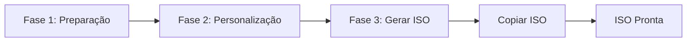
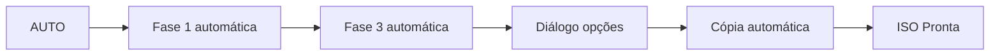

# 📘 Guia do Usuário - Eggsmaker WEB

## 📋 Índice

1. [Introdução](#introdução)
2. [Instalação](#instalação)
3. [Primeiro Início](#primeiro-início)
4. [Interface Principal](#interface-principal)
5. [Fluxo de Trabalho](#fluxo-de-trabalho)
6. [Guia Passo a Passo](#guia-passo-a-passo)
7. [Modo AUTO](#modo-auto)
8. [Opções Avançadas](#opções-avançadas)
9. [Resolução de Problemas](#resolução-de-problemas)
10. [FAQ](#faq)

---

## 🎯 Introdução

**Eggsmaker WEB** é uma interface gráfica web moderna para **Penguins' Eggs**, a ferramenta para criar ISOs remasterizáveis de sistemas Linux.

### O que o Eggsmaker WEB faz?

- ✅ Cria ISOs do seu sistema Linux atual
- ✅ Clona seu desktop e configurações
- ✅ Personaliza a configuração da ISO
- ✅ Copia ISOs geradas para locais personalizados
- ✅ Gerencia e atualiza Penguins' Eggs e Calamares
- ✅ Limpa sessões de trabalho

### Pré-requisitos

- **Penguins' Eggs** instalado no sistema
- Permissões de **sudo** (será solicitada a senha no início)
- Python 3.8 ou superior
- Conexão com a internet (para atualizações)

---

## 📦 Instalação

### Método 1: Instalador Automático (Recomendado)

#### Instalação Local (Usuário)
```bash
cd /caminho/para/eggsmaker-nicegui
./install.sh
```

Isso instalará o Eggsmaker WEB em `~/.local/share/eggsmaker-web`

#### Instalação Global (Sistema)
```bash
cd /caminho/para/eggsmaker-nicegui
sudo ./install.sh --system
```

Isso instalará o Eggsmaker WEB em `/opt/eggsmaker-web`

### Método 2: Instalação com pip

```bash
cd /caminho/para/eggsmaker-nicegui
pip install -e .
```

### Método 3: Execução Direta (Sem Instalação)

```bash
cd /caminho/para/eggsmaker-nicegui
python3 main.py
```

---

## 🚀 Primeiro Início

### 1. Executar o Aplicativo

Após a instalação:
```bash
eggsmaker-web
```

Ou no menu de aplicativos: procure por **"Eggsmaker WEB"**

### 2. Autenticação Inicial

Ao iniciar, aparecerá uma caixa de diálogo solicitando a **senha de sudo**:

```
┌─────────────────────────────┐
│ Autenticação necessária     │
│ (sudo)                      │
│                             │
│ Senha sudo: [****]          │
│                             │
│ [OK]       [Cancelar]       │
└─────────────────────────────┘
```

> 💡 **Importante**: Esta senha é necessária para executar comandos privilegiados do Penguins' Eggs.

### 3. Navegador Web

O aplicativo abrirá automaticamente no seu navegador padrão em:
```
http://localhost:8080
```

Se você precisar acessar de outro dispositivo na rede:
```
http://IP_DA_SUA_MAQUINA:8080
```

---

## 🖥️ Interface Principal

### Barra Superior

```
┌──────────────────────────────────────────────────────────────┐
│ 🥚 Eggsmaker - Versão 25.12.01       Eggsmaker              │
│                                                              │
│                              Penguins' Eggs: X.X.X           │
│                              Calamares: X.X.X                │
└──────────────────────────────────────────────────────────────┘
```

### Terminal de Saída

```
┌──────────────────────────────────────────────────────────────┐
│ Terminal de saída (log de comandos e operações)            │
│                                                              │
│ > Iniciando...                                              │
│ > ...                                                        │
└──────────────────────────────────────────────────────────────┘
```

### Painel de Controle (6 Cartões)

```
┌──────────┬──────────┬──────────┬──────────┬──────────┬──────────┐
│ Fase 1   │ Fase 2   │ Fase 3   │ Copiar   │  AUTO    │ Sessão   │
│          │          │          │   ISO    │          │          │
└──────────┴──────────┴──────────┴──────────┴──────────┴──────────┘
```

### Barra de Status

```
┌──────────────────────────────────────────────────────────────┐
│ Status: Aguardando                                           │
│ ████████████████████░░░░░░░░░ 65%                          │
│                                                              │
│ 65% | Cópias: 2 | ISO: 3.5 GB | Cópia: 00:02:30 | ...      │
└──────────────────────────────────────────────────────────────┘
```

---

## 🔄 Fluxo de Trabalho

### Fluxo Completo (3 Fases + Cópia)



### Fluxo Automático



---

## 📖 Guia Passo a Passo

### 🔹 FASE 1: Preparação

**Objetivo**: Preparar o sistema para a criação da ISO

#### Opções:

**🔘 Início (Manual)**
- `Ativado`: Executa apenas limpeza e preparação básica
- `Desativado`: Muda para o modo AUTO (veja seção Modo AUTO)

**🔘 Atualizar Eggs e Calamares**
- `Ativado`: Baixa e instala as últimas versões do Penguins' Eggs e Calamares do GitHub
- `Desativado`: Usa as versões instaladas atualmente

> ⚠️ **Nota**: Se você ativar "Atualizar Eggs e Calamares", o interruptor "Início (Manual)" será desativado automaticamente.

#### Ações realizadas:

1. `eggs kill -n` - Para processos anteriores do Eggs
2. `eggs tools clean -n` - Limpa arquivos temporários
3. `eggs dad -d` - Verifica e cria estrutura de diretórios
4. `eggs calamares --install` - Instala Calamares (se ativado)

#### Botão: **[Fase 1]**

Ao completar, habilita as opções da Fase 2.

---

### 🔹 FASE 2: Personalização (Opcional)

**Objetivo**: Personalizar o conteúdo da ISO

#### Opções:

**🔘 Clonar Desktop**
- Copia seu desktop atual para o perfil de usuário da ISO
- Inclui: configurações, temas, ícones, papéis de parede, etc.
- Comando executado: `sudo eggs tools skel`

**🔘 Personalizar ISO**
- Abre uma caixa de diálogo para editar configurações avançadas da ISO
- Permite configurar:
  - **Senha de root**: Senha do usuário root na ISO
  - **Nome base do snapshot**: Nome base para a ISO (ex: "minha-distro")
  - **Prefixo do snapshot**: Prefixo adicional (ex: "personalizada-")
  - **Senha de usuário**: Senha padrão para usuários

> 💡 **Dica**: Essas configurações são salvas em `/etc/penguins-eggs.d/eggs.yaml`

#### Botão: **[Fase 2]**

Executa as ações selecionadas. Esta fase é opcional.

---

### 🔹 FASE 3: Gerar ISO

**Objetivo**: Criar o arquivo ISO do seu sistema

#### Opções:

**🔘 Incluir dados**
- `Ativado`: Cria ISO com `/home` completo (modo clone)
- `Desativado`: Cria ISO apenas do sistema (mais leve)
- Comando: `sudo eggs produce --clone -n` (ativado) ou `sudo eggs produce --noicon -n` (desativado)

**🔘 Máxima compressão**
- `Ativado`: Cria ISO com compressão máxima (menor, mais lenta)
- `Desativado`: Compressão padrão
- Comando: `sudo eggs produce --pendrive -n`

> ⚠️ **Aviso**: A geração da ISO pode levar vários minutos dependendo do tamanho do sistema.

#### Botão: **[Fase 3]**

Durante a geração:
- Barra de progresso em modo "indeterminado" (ondulada)
- Status: "Executando: Fase 3 (Gerar ISO)"
- Terminal mostra saída em tempo real

Ao finalizar:
- Mostra o tamanho da ISO gerada
- Localização típica: `/home/eggs/*.iso` ou `/home/eggs/.mnt/*.iso`

---

### 🔹 COPIAR ISO

**Objetivo**: Copiar a ISO gerada para um local personalizado

#### Opções:

**🔘 Rápida**
- `Ativado`: Copia na velocidade máxima
- `Desativado`: Copia com pausa (mais lenta, menos carga no sistema)

**📁 Diretório de Destino**
- Campo de texto com o caminho de destino
- Clique em 🗁 para abrir o navegador de diretórios
- Padrão: diretório home do usuário

#### Seletor de Diretório

```
┌─────────────────────────────────────┐
│ Selecionar diretório destino       │
├─────────────────────────────────────┤
│ Caminho atual: /home/usuario        │
│                                     │
│ 📁 Documentos                       │
│ 📁 Downloads                        │
│ 📁 Área de Trabalho                 │
│ 📁 Imagens                          │
│ 📁 usb-drive                        │
│                                     │
│         [Cancelar] [Selecionar]     │
└─────────────────────────────────────┘
```

#### Botão: **[Copiar ISO]**

Durante a cópia:
- Barra de progresso **vermelha** com porcentagem
- Status: "Executando: Copiar ISO"
- Mostra: `XX%` grande
- Contador de cópias incrementa

> 💡 **Dica**: Você pode copiar a mesma ISO várias vezes para locais diferentes.

---

### 🔹 MODO AUTO

**Objetivo**: Executar todo o processo automaticamente

#### Como ativar o modo AUTO?

Desative o interruptor **"Início (Manual)"** na Fase 1:
- O botão da Fase 1 mudará para "fresh-eggs/calamares"
- O botão AUTO será habilitado

#### Fluxo do Modo AUTO:

1. **Fase 1**: Executa preparação automaticamente
2. **Fase 3**: Gera a ISO automaticamente
3. **Diálogo de opções de cópia**: Aparece automaticamente

```
┌─────────────────────────────────────┐
│ Opções de Cópia                     │
├─────────────────────────────────────┤
│ 🔘 Cópia Rápida                     │
│                                     │
│ Diretório de Destino:               │
│ /home/usuario [🗁]                  │
│                                     │
│         [Cancelar] [Continuar]      │
└─────────────────────────────────────┘
```

4. **Cópia**: Copia a ISO de acordo com as opções selecionadas

#### Botão: **[AUTO]**

Inicia todo o processo com um único clique.

**Indicadores Visuais:**
- 🔴 **Vermelho (Pulsando)**: O processo AUTO está em execução.
- 🟢 **Verde**: O processo terminou com sucesso.
- 🔵 **Azul**: Estado normal / inativo.

> ⚠️ **Nota**: A Fase 2 (personalização) NÃO é executada no modo AUTO. Se você precisar personalizar, use o fluxo manual.

---

### 🔹 SESSÃO: Limpar Sessão

**Objetivo**: Excluir a pasta de trabalho `/home/eggs`

#### Botão: **[Limpar sessão]**

Ao clicar, é mostrada uma confirmação:

```
┌─────────────────────────────────────┐
│ Excluir a pasta /home/eggs          │
│ completamente?                      │
│                                     │
│ Tamanho atual: 3.5 GB              │
│                                     │
│      [Confirmar] [Cancelar]        │
└─────────────────────────────────────┘
```

Ao confirmar:
- Exclui `/home/eggs` completamente
- Limpa o terminal de log
- Libera espaço em disco

> 💡 **Quando usar**: Depois de copiar a ISO para seu local final, ou quando precisar liberar espaço.

---

## ⚡ Opções Avançadas

### 🔧 Editar Configuração ISO

Acessível em Fase 2 → "Personalizar ISO"

#### Campos Editáveis:

| Campo | Descrição | Exemplo |
|-------|-----------|---------|
| **Senha de root** | Senha do superusuário na ISO | `toor123` |
| **Nome base do snapshot** | Nome da distribuição | `minha-distro` |
| **Prefixo do snapshot** | Prefixo para versões | `custom-` |
| **Senha de usuário** | Senha do usuário live | `live123` |

> 📝 **Arquivo editado**: `/etc/penguins-eggs.d/eggs.yaml`

### 📊 Indicadores em Tempo Real

#### Cronômetros

| Cronômetro | Cor | Descrição |
|------------|-----|-----------|
| **Cópia** | Ciano | Tempo de cópia atual |
| **Geração** | Vermelho | Tempo de geração ISO |
| **Total** | Verde Lima | Soma de todos os tempos |

#### Barra de Progresso

- **Azul claro**: Operações normais (Fase 1, Fase 3)
- **Ondulada**: Geração de ISO (duração indeterminada)
- **Vermelha**: Cópia de ISO (mostra porcentagem exata)

#### Indicadores Adicionais

- **Tamanho ISO**: Atualiza após a geração
- **Cópias realizadas**: Contador de cópias bem-sucedidas
- **Porcentagem**: Durante a cópia (0-100%)

---

## 🔍 Resolução de Problemas

### ❌ Erro: "Senha de sudo necessária"

**Causa**: A senha não foi fornecida no início ou a sessão expirou.

**Solução**: Recarregue a página web e forneça a senha novamente.

---

### ❌ Erro: "ISO para copiar não encontrada"

**Causa**: A ISO não foi gerada corretamente ou não está no local esperado.

**Soluções**:
1. Verifique se a Fase 3 foi concluída com sucesso
2. Verifique o terminal de log para erros durante a geração
3. Verifique manualmente se o arquivo existe:
   ```bash
   ls -lh /home/eggs/*.iso
   ls -lh /home/eggs/.mnt/*.iso
   ```

---

### ❌ Erro durante atualização Eggs/Calamares

**Causa**: Problemas de rede ou permissões.

**Soluções**:
1. Verifique sua conexão com a internet
2. Tente manualmente:
   ```bash
   cd ~
   git clone https://github.com/pieroproietti/fresh-eggs
   cd fresh-eggs
   sudo ./fresh-eggs.sh
   ```

---

### ⚠️ O aplicativo não abre no navegador

**Soluções**:
1. Abra manualmente: `http://localhost:8080`
2. Verifique se a porta está disponível:
   ```bash
   netstat -tuln | grep 8080
   ```
3. Use uma porta diferente:
   ```bash
   PORT=8081 eggsmaker-web
   ```

---

### ⚠️ "Permissão negada" ao copiar ISO

**Causa**: A ISO está em um diretório protegido.

**Solução**: O aplicativo tentará automaticamente usar `sudo` para copiar.

---

### 🐛 O terminal não mostra saída

**Solução**: Recarregue a página web (F5).

---

## ❓ FAQ

### Quanto espaço eu preciso para criar uma ISO?

Depende do modo:
- **Sem dados**: ~2-5 GB
- **Com dados (/home completo)**: Tamanho do seu `/home` + 2-5 GB
- **Máxima compressão**: ~70-80% do tamanho normal

> 💡 **Dica**: Use "Limpar sessão" depois de copiar a ISO para liberar espaço.

---

### Posso usar o Eggsmaker WEB de outro dispositivo na rede?

Sim. O aplicativo mostra o endereço de rede no rodapé:
```
Acesso em rede: http://192.168.1.100:8080
```

Use esse endereço de qualquer navegador na mesma rede local.

> ⚠️ **Segurança**: Certifique-se de estar em uma rede confiável.

---

### O que acontece se eu fechar o navegador durante uma operação?

A operação **continua em execução** em segundo plano. Você pode:
1. Reabrir `http://localhost:8080`
2. Ver o progresso no terminal

---

### Posso cancelar uma operação em andamento?

Atualmente não há botão de cancelar. Opções:
1. Esperar terminar
2. Fechar o aplicativo completamente (Ctrl+C no terminal)
3. Usar "Limpar sessão" depois para limpar arquivos parciais

---

### É seguro usar o modo AUTO?

Sim, mas tenha em mente:
- ✅ Não executa a Fase 2 (não clona desktop nem personaliza)
- ✅ Usa configurações padrão
- ❌ Não permite personalização durante o processo

**Recomendado para**: Criação rápida de ISOs padrão sem personalização.

---

### Onde as ISOs geradas são salvas?

Locais típicos (verificados em ordem):
1. `/home/eggs/` - Local principal
2. `/home/eggs/.mnt/` - Local alternativo

O tamanho é mostrado automaticamente na barra de status.

---

### Posso criar várias ISOs sem limpar a sessão?

Sim, mas:
- ⚠️ A nova ISO substituirá a anterior em `/home/eggs/`
- 💡 **Dica**: Copie cada ISO antes de gerar a próxima

---

### Como atualizo o Eggsmaker WEB?

```bash
cd /caminho/para/eggsmaker-nicegui
git pull
./install.sh  # Reinstalar
```

Ou se você usou pip:
```bash
pip install -e . --upgrade
```

---

## 📚 Recursos Adicionais

### Links Úteis

- **Penguins' Eggs**: https://penguins-eggs.net/
- **Repositório GitHub**: https://github.com/pieroproietti/penguins-eggs
- **Documentação Eggs**: https://penguins-eggs.net/docs/

### Suporte

Para problemas específicos do Eggsmaker WEB, verifique:
- O terminal de log no aplicativo
- Os arquivos de log do sistema
- A comunidade do Penguins' Eggs

---

## 📝 Resumo de Comandos Rápidos

### Fluxo Manual Completo
```
1. Fase 1 (Preparação)
2. Fase 2 (Personalizar - opcional)
3. Fase 3 (Gerar ISO)
4. Copiar ISO
5. Limpar sessão
```

### Fluxo AUTO
```
1. Desativar "Início (Manual)"
2. Clique em "AUTO"
3. Aguarde geração
4. Configure opções de cópia
5. Clique em "Continuar"
6. Limpar sessão
```

### Atualização Rápida Eggs
```
1. Ativar "Atualizar Eggs e Calamares"
2. Clique em "Fase 1"
3. Aguarde atualização
```

---

## 🎉 Divirta-se criando suas ISOs!

Este guia cobre todas as principais funcionalidades do Eggsmaker WEB. Para uso avançado, consulte a documentação do Penguins' Eggs.

**Versão do guia**: 1.0
**Compatível com**: Eggsmaker WEB v25.12.01
